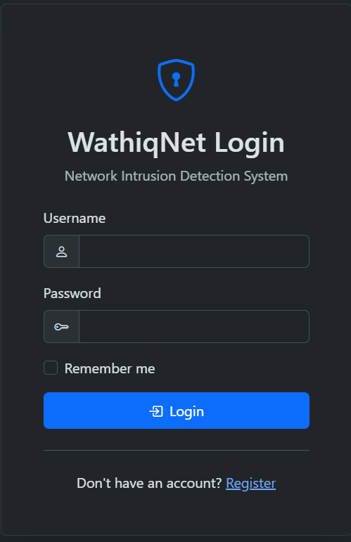
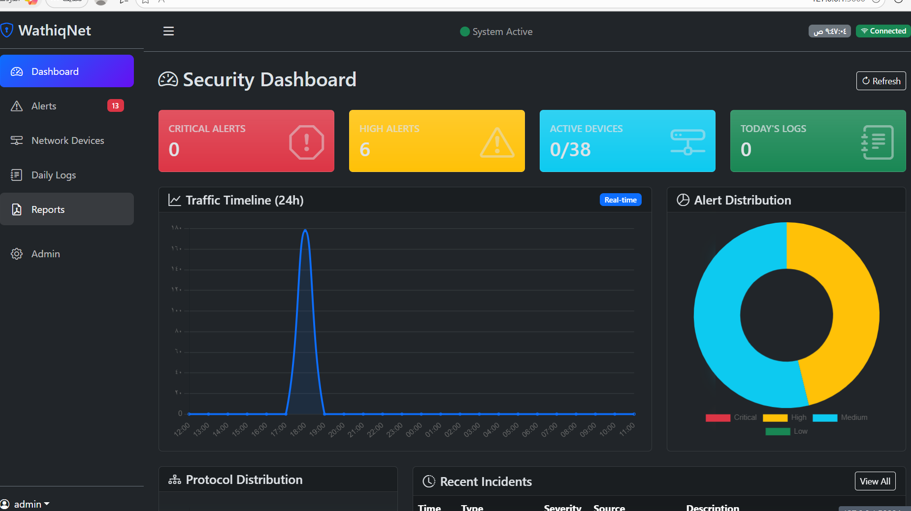
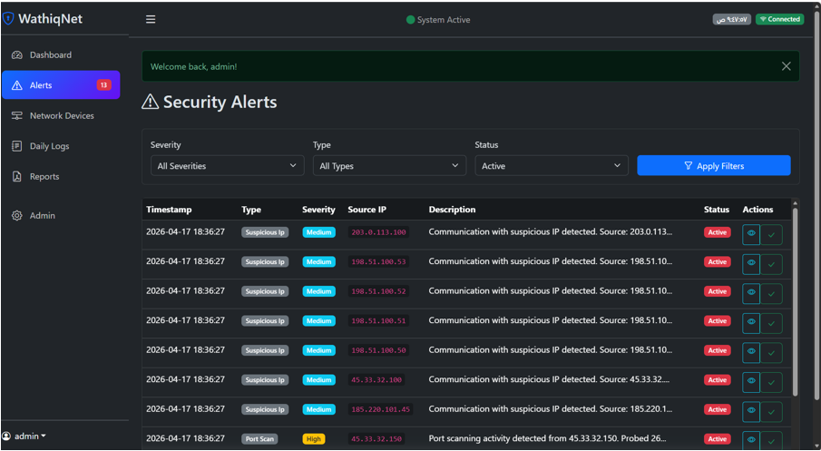
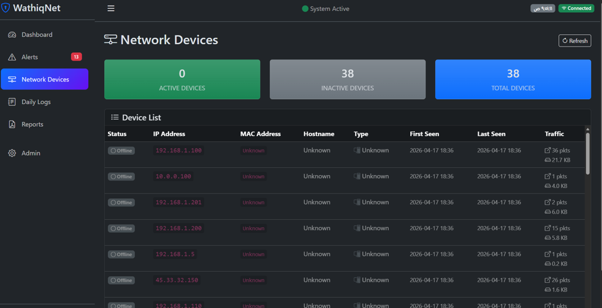
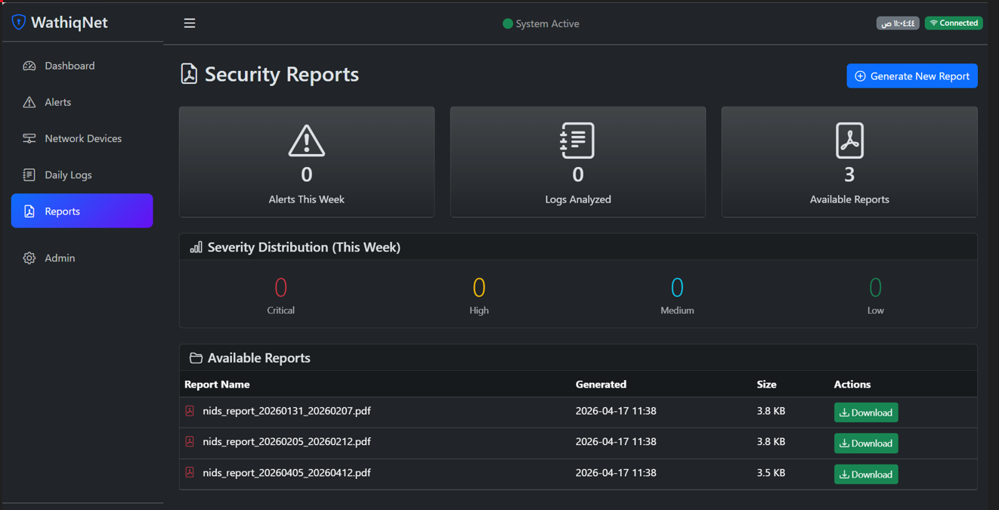
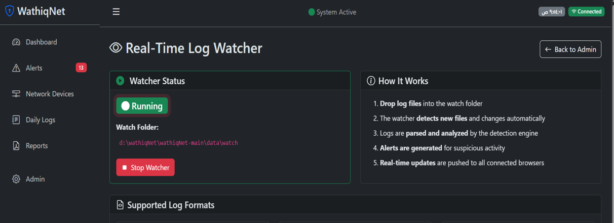

# WathiqNet

## Network Security Monitoring System for Small Businesses

WathiqNet is a Flask-based Network Security Monitoring (NSM) system designed to help small businesses monitor network activities, detect suspicious behavior, and generate security reports in a simple and cost-effective way.

---

## Features

- User Authentication
- Dashboard
- Real-time Network Monitoring
- Intrusion Detection
- Alert Management
- Device Management
- Security Reports
- Log Analysis
- Packet Capture
- PDF Report Generation

---

## Technologies Used

- Python
- Flask
- HTML
- CSS
- JavaScript
- SQLite
- Bootstrap

---

## Project Structure

```
WathiqNet/
│
├── app/
├── templates/
├── static/
├── data/
├── docs/
├── Screenshots/
├── requirements.txt
├── run.py
└── README.md
```

---

## Installation

Clone the repository:

```bash
git clone https://github.com/malakalfaifi/WathiqNet.git
```

Install requirements:

```bash
pip install -r requirements.txt
```

Run the application:

```bash
python run.py
```

---

## System Screenshots

### Login



### Dashboard



### Alerts



### Devices



### Reports



### Watcher



---

## Documentation


- [Project Report (PDF)](docs/WathiqNet_Report.pdf)
- [Project Presentation (PowerPoint)](docs/WathiqNet.pptx)

---

## Author

Malak Al-Faifi

Information Technology Graduate
Cybersecurity Track

Jazan University
Saudi Arabia
